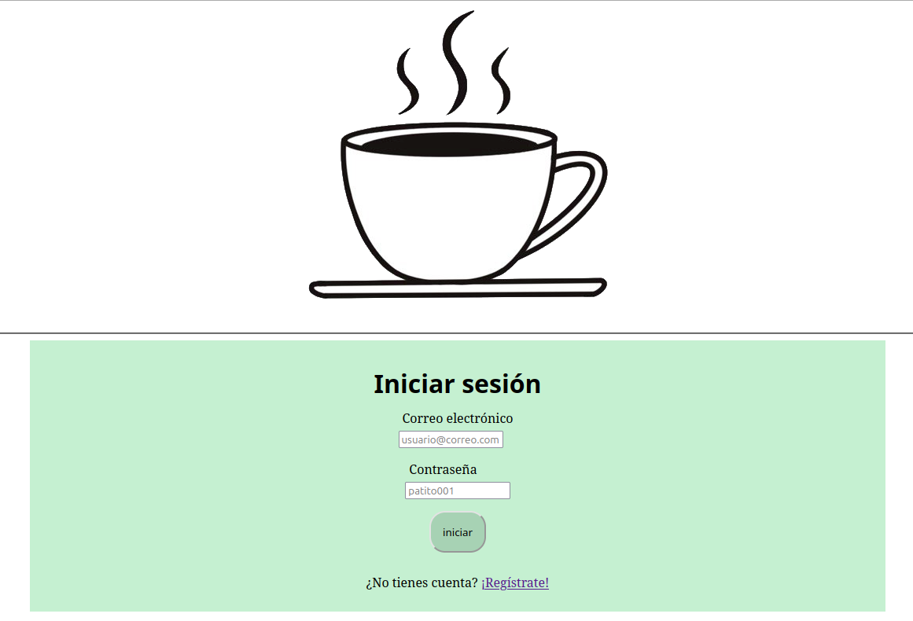

# chin-chin-tlacuachin
Aplicación web para el punto de venta de "Chin Chin Tlacuachín"



## Instalación de programas necesarios para ejecutar el punto de venta

### Sobre python3
Python3 no permite la instalación de paquetes sin un ambiente virtual, por lo que instalamos pip y venv para poder crear un ambiente virtual e instalar los paquetes que necesitemos.
```bash
$ sudo apt install python3-venv
$ sudo apt install python3-pip
```

Luego creamos el ambiente virtual con:
```bash
$ python3 -m venv <foo>
```

### Ambiente virtual
Activamos el ambiente virtual antes de instalar con pip
**activar**
```bash
$ source env_name/bin/activate
```

**desactivar**
```bash
$ deactivate
```

### Paquetes PIP
Se recomienda instalar manualmente los paquetes para tener la última version disponible
```bash
$ pip install Flask
$ pip install flask-sqlalchemy
$ pip install pymysql
$ pip install cryptography #??
$ pip install waitress # Servidor pro, no modo debug
$ pip install livereload #Recargar el frontend automaticamente
$ pip install Flask-Migration #Relacionado a migraciones
```

### Verificar lista de paquetes
```bash
$ pip list
```

Los paquetes se pueden instalar automáticamente desde la lista de paquetes de `requirements.txt` como.
```bash
(foo)$ pip install -r requirements.txt
```

O si hay alguna modificación de paquete, guardar con:

```bash
(foo)$ pip freeze > requirements.txt
```

## Ejecutar proyecto

Ejecución en modo desarrollo:
```bash
$ python3 main.py
```

Modo producción. Necesitamos exportar las siguientes variables. Los
parámetros **--host y --port** nos dicen la ip y el puerto.**--call**
para regresar el objeto *Flask(__name__)*

```bash
$ export FLASK_APP=main
$ waitress-serve --host localhost --port=8080 --call main:cafeteria_alina
```


# SQL
Para poder conectarse la base de datos correctamente, se deben especificar correctamente las credenciales en el archivo
config.py
```python
 PORT: 3306 (usually)
 USERNAME: 'root' (usually)
 PASSWORD: 1234 (usually, or whatever the password is)
```
### Acceder desde la terminal
Para acceder a la base de datos desde la terminal (previamente configurada a la hora de instalar mysql)
```bash
$ mysql -u <user> -p 
$ 1234
```

También, ya debe de existir la base de datos antes de ejecutar el programa
```sql
mysql> CREATE DATABASE <database_name> 
```

## PASOS PARA LA MIGRACION de datos (crear nuevas columnas, modificar valores de columnas)
1. instalar pip install Flask-Migration
2. Crear las tablas que se asociarán con esta columna, reiniciando la aplicacion.
3. exportar la variable export FLASK_APP=main
4. flask db init <- crea la carpeta de migration/
5. flask db migrate -m "Mensaje de la migracion" <- crea el script de la migracion
6. flask db upgrade <- ejecuta el script de la migracion.
7. En caso de haber problemas con constantes, valores por default deben ser creados y /o los valores asociados a las constantes con default=algo, o UPDATE tabla SET c1 = ":)"


# Javascript
NPM dependecies (instalar cuando se pueda)

- mathjs


Instalar repositorio para imprimir en POS 

```bash
$ less src/static/php/ticket_template.php
```
